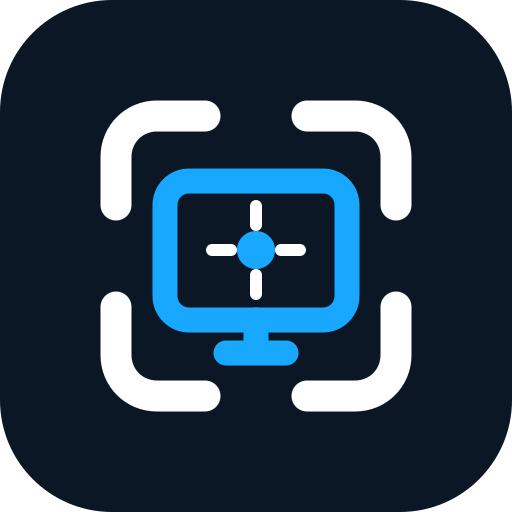
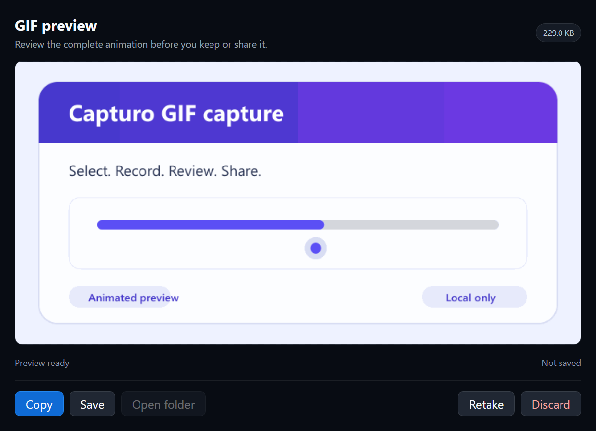
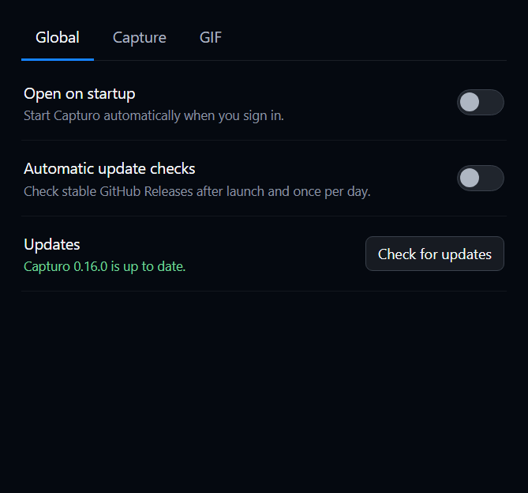

<p align="center">
  
</p>

# 📸 Capturo

Capturo is a fast, local screenshot and GIF tool. It lives in the notification area or menu bar, opens straight into region selection, and gets out of the way when you finish. There is no dashboard, account, cloud storage, telemetry, or history database.


> 🪟 **Windows 11 is the supported platform.** It is the only one with published packages.
>
> 🍎 **macOS runs but is a preview, and there is no macOS download.** Capture, the menu-bar flow,
> settings, permissions, and start-at-login now work on Apple Silicon (verified on macOS 26.2), but
> Capturo has no Apple Developer ID certificate, so a macOS build cannot be notarized and Gatekeeper
> refuses it on any machine that downloads it. Until that certificate exists macOS is build-from-
> source only. See [macOS](#-macos) below.


## ⬇️ Download

Download the Windows installer from [GitHub Releases](https://github.com/mtom2k/capturo/releases/latest).

| Artifact | Purpose |
| --- | --- |
| `Capturo-Setup-<version>-x64.exe` | Interactive Windows installer, published with each release |
| `Capturo-Portable-<version>-x64.exe` | Portable build, produced locally for validation |

Official GitHub releases publish the installer only. Both local artifacts are kept in `release/`, and `BUILD-INFO.txt` records their sizes and SHA-256 hashes.

Source is at **0.20.0**; the newest *published* release may lag it, since a stable release is cut only after its Windows installer passes acceptance. There is no macOS download — see [macOS](#-macos).

Windows may show an unknown-publisher warning because current builds are not Authenticode-signed. Choose **More info**, then **Run anyway** if you trust the downloaded checksum.

Version 0.20.0 introduces the rounded-card "C" logo shown above, applied across the installer, executable, Settings window, taskbar, notification area, and notifications. Its delivered backdrop is keyed out so the icon has transparent corners, and the macOS menu bar gets a monochrome version that follows the system bar. Version 0.19.0 made macOS a working preview.

## 🍎 macOS

macOS support is real but unfinished, and the gap is a certificate rather than code.

**Working**, verified on macOS 26.2 (Apple Silicon): menu-bar icon opens capture on a single click,
the overlay covers the whole display including the menu bar and the Dock, `Esc` cancels immediately,
region selection and annotation, save, clipboard copy, GIF recording and preview, GIF copy as an
animated file, Screen Recording permission flow in Settings, and Open on startup.

**Not available on macOS:** **Copy text**. OCR runs through the native Windows helper and
`Windows.Media.Ocr`; there is no macOS equivalent yet. HDR-correct capture is likewise Windows-only,
since macOS falls back to Electron's `desktopCapturer`.

**Permissions.** Only one is required — **Screen Recording**, which covers screenshots and GIF alike.
Notifications and Login Items are optional and only appear if you use those features. Capturo
declares no camera, microphone, or Bluetooth usage and cannot capture audio.

macOS applies a new Screen Recording grant only to a newly launched app, so Capturo offers a
**Reopen Capturo** button wherever it asks for the permission.

**Why there is no download.** Distribution needs an Apple Developer ID certificate for notarization.
Without one, a locally built Capturo is ad-hoc signed, which has two consequences: Gatekeeper blocks
it on any machine that downloads it, and macOS ties the Screen Recording grant to the build's own
code hash, so the permission has to be granted again after every rebuild. Local development can
avoid the second one with a self-signed certificate; see [RELEASING.md](./RELEASING.md).

Build it yourself with `npm run dist:mac`. Arm64 only unless you ask for `--x64` or `--universal`.

## ✨ What Capturo can do

- Select, move, and resize a precise screen region on scaled or multi-display desktops.
- Draw with Pen, Line, Arrow, Rectangle, Ellipse, numbered Step, and Text tools.
- Add Blur and Pixelate regions with independent 1 to 100 percent intensity.
- Remove a connected background color with tolerance, feathering, live Before/After/Split preview, and Undo.
- Extract visible text with local Windows OCR and copy it as plain text (Windows only).
- Pick a color from anywhere on screen with a magnifier, and adjust or copy it as HEX, RGB, or HSL.
- Record a GIF with a configurable pre-timer, frame rate, quality, pause/resume, and protected recording controls.
- Review GIFs before export, then Copy, Save, Open folder, Retake, or Discard.
- Capture HDR displays through a native Windows helper without washed-out SDR content (Windows only).
- Save PNG or JPEG files, copy a lossless image, and rebind screenshot and GIF shortcuts.
- Start at login on Windows or macOS, and check GitHub Releases for updates when you choose.

## 🖼️ Screenshot workflow

1. Click the Capturo tray or menu-bar icon, or press `Ctrl/Cmd + Shift + 2`.
2. Drag a region. Move it from inside, or resize it from an edge or corner.
3. Annotate or apply privacy and transparency tools.
4. Copy the image, copy its visible text, or save it.


The primary toolbar stays close to the selection. A second row appears only when the active tool needs options such as color, stroke width, text style, or effect intensity.

Text is placed by clicking away from the box or pressing `Ctrl/Cmd+Enter`; `Esc` discards it, and a second `Esc` cancels the capture. Drag the box's bottom-right corner to resize it, and double-click placed text with Select to edit it again.

### Copy text with Windows OCR

**Copy text** sits beside regular Copy. It recognizes the final visible selection, including its crop, annotations, Blur or Pixelate regions, and any pending transparency preview. Successful recognition copies plain text and closes the editor. Empty or failed recognition leaves the editor open with a useful message.

OCR runs locally through Windows and uses language packs installed for the current user. Capturo does not upload the image, download a model, or create a temporary screenshot. OCR can still confuse small, stylized, rotated, low-contrast, or obscured characters, so review important results.

### Transparent backgrounds

Choose **Transparent background** or press `K`, then sample the background inside the selection. Capturo removes only matching pixels connected to that point, which protects separated foreground areas that happen to share the same color.

Tolerance includes nearby tones, and Edge feather smooths the cutout from 0 to 10 pixels. You can also enter hex or RGB values and compare Before, After, or Split views. Copy and Save automatically apply a pending preview. Any transparency operation forces PNG because JPEG cannot store alpha.

## 🎬 GIF recording

Choose **New GIF** from the tray or menu bar, or press `Ctrl/Cmd + Shift + 3`. Select a region, then press **Start Recording**. Capturo prepares the live stream and shows a protected countdown, 3 seconds by default, before active capture begins.

The recording bar supports Pause, Resume, Stop, a timer, and optional frame totals. Its red border, dimmed surroundings, and controls are excluded from the finished GIF. Playback timing follows real elapsed recording time, and encoder backpressure keeps memory bounded when a large region cannot sustain the requested frame rate.



The preview lets you Copy, Save, Open folder, Retake, or Discard. Copy places the animated `.gif` *file* on the clipboard rather than flattening it to a still image, on Windows through `CF_HDROP` and on macOS through a `public.file-url` pasteboard entry, so the animation survives the paste. An unsaved GIF is written to Capturo's temporary clipboard folder only after you explicitly choose Copy, and expired copies are cleaned during a later launch.

## 🎨 Color picker

**Color picker** in the tray menu freezes the desktop and replaces your mouse cursor with a
magnifier, centred on the pixel it is reading: the surrounding pixels at 17x, the sampled one
outlined in the middle of the aperture, and its hex value below. Hold **Shift** to slow sampling to an eighth speed, which is what makes a one-pixel
border or an anti-aliased edge pickable; the arrow keys nudge exactly one pixel. Click, `Enter`,
or `Space` picks; `Esc` cancels.

**Picking copies the color straight to your clipboard.** The color window then shows the value as HEX, RGB, or HSL with live hue, saturation, lightness and
alpha sliders, a row of related colors, and the nearest color name. Type a hex value to jump to one
directly, copy again in another format with `Ctrl/Cmd+C`, or use **Pick again** to go back to the
screen without losing the color you already have. The window gets out of the way while you pick, so
you can sample the pixels it was covering.

Because the desktop is frozen when the picker opens, a color cannot be picked out of a playing
video or animation; reopen the picker to sample the current frame.

## ⌨️ Shortcuts

| Shortcut | Action |
| --- | --- |
| `Ctrl/Cmd + Shift + 2` | Start screenshot capture |
| `Ctrl/Cmd + Shift + 3` | Start GIF capture |
| `Ctrl/Cmd + C` | Copy image |
| `Ctrl/Cmd + Shift + C` | Extract and copy visible text (Windows) |
| `Ctrl/Cmd + S` | Save |
| `Ctrl/Cmd + Z` | Undo |
| `Delete` | Delete selected annotation |
| `Ctrl/Cmd + Enter` | Place the text being typed |
| `Esc` | Discard the text being typed, otherwise cancel capture or close GIF preview |

Tool keys: `V` Select, `P` Pen, `L` Line, `A` Arrow, `R` Rectangle, `E` Ellipse, `N` Step, `T` Text, `B` Blur, `X` Pixelate, and `K` Transparent background.

## ⚙️ Settings

Right-click the tray icon and choose **Settings**.

- **Global:** Open on startup, optional daily update checks, and manual Check for updates.
- **Capture:** PNG or JPEG, JPEG quality, copy/save notifications, and capture shortcut.
- **GIF:** 10 to 30 fps, quality, 0 to 10 second pre-timer, frame-count visibility, and GIF shortcut.

Preferences live in `settings.json` under Capturo's user-data folder. The file contains options and the last update-check time, never captured pixels.



## 🔒 Privacy

- No account, login, telemetry, analytics, or crash reporting.
- Captures and OCR pixels stay local.
- The only optional network request checks Capturo's public GitHub Release version. It sends no account token, device identifier, capture, or settings data, and never downloads an update.
- Screenshot pixels reach disk only when you Save. The one exception is an unsaved GIF that you explicitly Copy, because the Windows clipboard carries its file path.
- Renderers use sandboxing, context isolation, and no Node.js access. Native actions pass through narrow IPC handlers owned by the main process.

## ⚠️ Current limits

- A selection stays on one physical display and cannot span monitors.
- A drag must start in the work area, although it can continue over the taskbar.
- OCR quality depends on the source image and installed Windows language packs.
- Windows packages are unsigned and may trigger SmartScreen.
- macOS remains unsupported and unpublished. A macOS build can be produced and launched, but it
  cannot capture: macOS will not attach a Screen Recording permission to an unsigned app, so
  capture requires an Apple Developer ID certificate and notarization that Capturo does not yet
  have. See [RELEASING.md](./RELEASING.md).

## 🛠️ Build from source

Capturo needs Node.js 20 or newer.

```powershell
git clone https://github.com/mtom2k/capturo.git
cd capturo
npm install
npm run dev
```

Useful commands:

```powershell
npm run icons      # regenerate every brand asset from build/icon-source.png
npm run build      # typecheck, run tests, and build the production app
npm run dist:win   # build Windows Setup and Portable artifacts into release/
npm run dist:mac   # build macOS DMG and ZIP into release/ (run on macOS)
```

HDR capture, local OCR, GIF file copy, and recording-window styling use `native/capturo-capture`. Build it with the Visual Studio **Desktop development with C++** workload and Windows SDK:

```powershell
native\capturo-capture\build.cmd
```

That helper is Windows-only and is scoped to the Windows target, so a macOS build does not need it
and simply goes without HDR-correct capture and Copy text.

Capturo is one codebase, not a fork per platform. Platform differences are decided in the main
process and handed to the renderers as data, and platform-varying logic is written as pure
functions with a platform flag so both branches are unit-tested on any machine. See
[ARCHITECTURE.md](./ARCHITECTURE.md).

## 📚 Developer documentation

- [ARCHITECTURE.md](./ARCHITECTURE.md) explains process boundaries and data flow.
- [DECISIONS.md](./DECISIONS.md) records durable design choices.
- [PROJECT_STATE.md](./PROJECT_STATE.md) tracks verified behavior and remaining work.
- [HANDOFF.md](./HANDOFF.md) is the shortest path for the next developer or LLM.
- [TESTING.md](./TESTING.md) contains automated and desktop test matrices.
- [CONTRIBUTING.md](./CONTRIBUTING.md), [RELEASING.md](./RELEASING.md), and [CHANGELOG.md](./CHANGELOG.md) cover maintenance and releases.

## 📄 License

MIT. See [LICENSE](./LICENSE).
