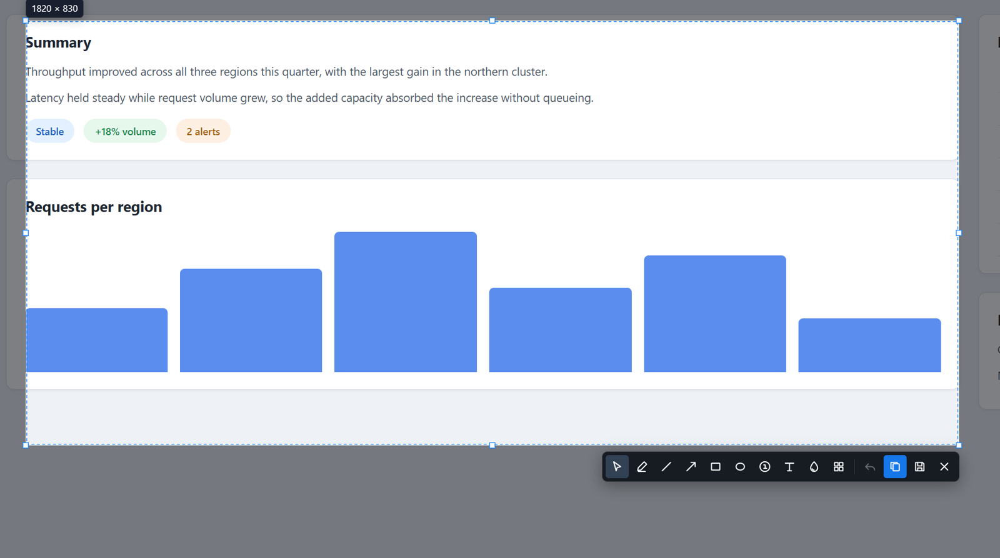
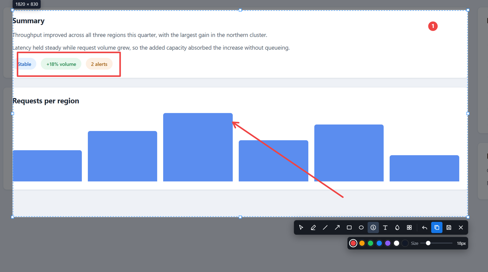
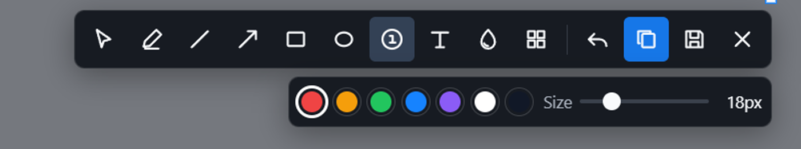

# 📸 Capturo

A small screenshot tool that lives in your tray and opens straight into region selection. No dashboard, no account, no cloud, no telemetry. Press the shortcut, drag a box, annotate it, copy it, done.


> ### 🪟 Windows only, for now
>
> Capturo is developed and tested on Windows 11. **The macOS build has never been run on real Apple hardware.** The code paths exist and `npm run dist:mac` will produce a DMG, but nothing about it has been verified: not launching, not capturing, not the Screen Recording permission prompt, not Retina output, not the menu bar. The packages are also unsigned and un-notarized, so macOS will refuse to open them without manual intervention.
>
> Treat macOS as unsupported. If you try it, expect it to be broken, and please open an issue with what happened.



## ⬇️ Getting it

The supported Windows download is published on the project's [GitHub Releases](https://github.com/mtom2k/capturo/releases) page. Version 0.15.2 is the current source version; the latest published Windows x64 release remains v0.15.1 until 0.15.2 is explicitly packaged and released.

For the current source version, `npm run dist:win` produces two local Windows 0.15.2 artifacts in `release/`. Official releases publish the installer only:

| File | What it is |
| --- | --- |
| `Capturo-Setup-0.15.2-x64.exe` | Normal installer. Lets you pick the install folder. |
| `Capturo-Portable-0.15.2-x64.exe` | Portable executable for local validation. |

Alongside them, `BUILD-INFO.txt` records the version, build time, and a SHA-256 for each artifact, so you can always tell which build you are holding. The running app also reports its version in the tray tooltip and tray menu.

Windows will warn you that the publisher is unknown when you run either one. That is expected: the builds are not code-signed. Click **More info** then **Run anyway**.

There is no macOS download, and there will not be one until somebody has actually run it on a Mac. See the note at the top.

## ✨ Using it

1. Click the Capturo tray icon, or press `Ctrl + Shift + 2` (`Cmd + Shift + 2` on macOS, in theory).
2. The screen freezes. Drag to select a region. Drag inside it to move it, or grab an edge or corner to resize.
3. Annotate with pen, line, arrow, rectangle, ellipse, numbered step, text, blur, pixelate, or remove a connected background with the Transparent tool.
4. Pick the Select tool to click any existing annotation and move, resize, recolour, or restyle it. Double-click text to edit it. `Delete` removes what is selected.
5. `Ctrl + C` copies to the clipboard, `Ctrl + S` saves a PNG, `Esc` cancels.



The toolbar sits under the selection. Tools are on the first row; the second row changes to whatever the current tool needs, so you only ever see the controls that apply.



### ⌨️ Shortcuts

| Key | Tool | | Key | Action |
| --- | --- | --- | --- | --- |
| `V` | Select | | `Ctrl + C` | Copy |
| `P` | Pen | | `Ctrl + S` | Save as PNG |
| `L` | Line | | `Ctrl + Z` | Undo |
| `A` | Arrow | | `Delete` | Delete selected object |
| `R` | Rectangle | | `Esc` | Cancel capture |
| `E` | Ellipse | | | |
| `N` | Numbered step | | | |
| `T` | Text | | | |
| `B` | Blur | | | |
| `X` | Pixelate | | | |
| `K` | Transparent background | | | |

### 🎚️ Sizing

Stroke width and numbered-step size are pixel sliders, 1 to 24px and 10 to 48px, and they update as you drag so you can judge the size against the screenshot underneath. Text keeps a list of preset sizes from 12px to 48px. Pick an existing annotation with the Select tool and the slider jumps to that object's size, so you can adjust something you already drew.

### Transparent backgrounds

Choose **Transparent background** (or press `K`), then click the background color inside the capture. Capturo removes only matching pixels connected to that point, so the same color elsewhere behind a separated foreground object is retained. Adjust **Tolerance** to include nearby tones and **Edge feather** from 0-10px to smooth the cutout. The popup also accepts hex and RGB values and offers Before, After, and Split previews over a checkerboard; drag the blue divider directly or use its slider.

**Apply** adds one non-destructive operation to the normal undo history so you can keep editing, and `Ctrl/Cmd+Z` removes it. Apply is optional when exporting: pressing `Ctrl/Cmd+C`, `Ctrl/Cmd+S`, Copy, or Save automatically commits the pending transparency preview first. Capturo shows a small **PNG** flag while transparency is present. Save automatically uses PNG, overriding a JPEG preference or filename extension, because JPEG cannot preserve an alpha channel.

## ⚙️ Settings

Right-click the tray icon and choose **Settings…**. It is deliberately small, and opens only when you ask for it: closing it leaves Capturo resident in the tray as before.

- **Global → Open on startup.** Optionally launch Capturo into the notification area when you sign in to your device. It is off by default.
- **Format.** Save as PNG (lossless) or JPEG. There is a **JPEG quality** slider for when you want smaller files. Format and quality apply to files you **Save**; **Copy** always puts a lossless image on the clipboard.
- **Notification.** Turn the toast after a copy or save on or off.
- **Capture shortcut.** Click the shortcut, then press the combination you want (`Ctrl`/`Alt` with a key, or a function key). If the combination is already taken by another app, Capturo keeps the previous one and tells you.

The **GIF** tab controls GIF recording: **frame rate** (10-30 fps), a **quality** slider, a **pre-timer** from 0-10 seconds (3 seconds by default), a toggle for showing frame totals in the recording bar, and a rebindable **GIF shortcut**, all persisted the same way.

Preferences are stored in a small `settings.json` in your user-data folder. It is the only thing Capturo writes without you choosing Save, and it contains none of your screen pixels — just these few options.

## 🎬 Recording a GIF

> GIF capture shipped in 0.13.0. Copying a GIF to the clipboard is not included — save it, then
> share the file.

Click the tray icon and choose **New GIF**, or press `Ctrl + Shift + 3`, then drag a box around what you want to record — exactly like selecting a screenshot region. Press **Start Recording** and the box becomes live: a red ring frames it, everything outside dims to keep the focus on it, and the protected control bar counts down before capture begins. The default pre-timer is 3 seconds; choose 0-10 seconds in Settings → GIF, with 0 disabling it. Once the countdown reaches zero, the bar switches to **Pause/Resume**, **Stop**, a running timer, and—when enabled in GIF Settings—a frame count. Disabling **Frame count** also hides processed and encoded totals during finalization and saving. The mouse cursor is included, so interaction reads clearly. Press **Stop** to encode and save a `.gif`.

The ring, the dimming, and the control bar are all excluded from the recording, so the GIF contains only your region. Recordings can be any length, and pixels that do not change between frames are not re-encoded, so a mostly-static recording stays small while keeping its quality. Frame rate and quality come from the GIF settings tab.

Frame rate controls the requested sampling cadence. Playback timing follows the recording's active elapsed time, so a large region that cannot be sampled at the full requested rate still plays at real-world speed rather than speeding up; paused time is not included.

Capturo keeps only two frames in flight to the encoder. If a large or complex region cannot sustain the selected FPS, the control bar can report skipped sampling ticks instead of allowing an ever-growing encoding backlog; those gaps still retain their real elapsed duration. After Stop, the bar can show bounded finalization progress and then switches to Saving. The numeric reports are hidden when **Frame count** is off, but the same bounded processing still happens.

## 🌈 HDR displays

Screenshots come out the same whether your monitor is in HDR mode or not.

That is less automatic than it sounds. With HDR on, Windows composites the desktop in scRGB, where 1.0 means 80 nits and ordinary windows are rendered well above that depending on your *SDR content brightness* setting. Anything that converts to 8-bit without undoing that scale multiplies the whole image and clips the top off it. That is why screenshots from many tools look washed out on an HDR monitor, with white boxes and light backgrounds turned into flat white.

Capturo captures through a small native helper that keeps the frame in `R16G16B16A16_FLOAT`, reads the live SDR white level from Windows, normalises and tone maps in linear light, and only then encodes sRGB. Content at or below SDR white is reproduced with the values it was authored with.

Measured against a known pattern on a 4K HDR display, greys drawn as 0, 32, 64, 96, 128, 160, 192 and 255 come back as exactly those values.

The helper is Windows only and used only when it is present. It handles rotated displays too, turning the captured frame back to the desktop orientation. On other platforms, or a Windows machine without the helper, capture falls back to the normal path, which is already correct on SDR displays.

## 🔒 Privacy

Capturo handles your screen pixels, so it keeps them local:

- No network requests at all. Nothing is uploaded, ever.
- No telemetry, no analytics, no crash reporting.
- No account and no login.
- Captured pixels are never written to disk unless you choose **Save**. Capturo writes only its small, pixel-free `settings.json` automatically.

The renderer runs sandboxed with context isolation and no Node.js access. Every OS level action goes through a small set of explicit IPC handlers.

## ⚠️ Known issues

Worth knowing before you rely on it:

- **A selection cannot span two monitors.** Every display gets an overlay, but the first one you click owns the capture. Displays with different scale factors need a proper virtual desktop compositor to do this correctly.
- **A drag has to start outside the taskbar.** Once a selection is under way it extends over the taskbar normally, so you can capture the taskbar by starting just above it and dragging down. You just cannot begin the drag by pressing on the taskbar itself.
- **The native HDR helper still adds some capture cost** on Windows, because the frame is captured, tone mapped, and encoded before the overlay appears. This is now much smaller than it was: the overlay is revealed the instant it has painted with no artificial delay, displays are grabbed in parallel, the redundant `desktopCapturer` pass is skipped, and the helper no longer stalls on a static desktop.
- **macOS is untested.** Never run on real Apple hardware. Unsigned and un-notarized. See the note at the top of this file. Specifically unverified: launching, capturing, the Screen Recording permission flow, Retina output, menu bar behaviour, Spaces and full-screen apps, and how HDR and EDR displays behave, since the HDR fix here is Windows only.
- **Windows builds are unsigned**, so SmartScreen will complain. See [Getting it](#️-getting-it).
- **`npm run dist:win` can exit non-zero on the first run after deleting `release/`.** A file lock during Electron's extraction step. The artifacts are still built correctly and running the command again succeeds.

## 🛠️ Building from source

Needs Node.js 20 or newer.

```bash
git clone https://github.com/mtom2k/capturo.git
cd capturo
npm install
npm run dev
```

Checks and packaging:

```bash
npm run typecheck   # strict TypeScript across main, preload, and renderer
npm test            # geometry and annotation model tests
npm run build       # typecheck, tests, then a production build
npm run dist:win    # Windows installer and portable exe into release/
npm run dist:mac    # macOS DMG and ZIP, must be run on macOS, output is untested
```

### The native capture helper

The HDR path uses a small C++ executable in `native/capturo-capture`. Building it needs the **Desktop development with C++** workload of Visual Studio Build Tools, which also supplies the Windows SDK:

```bash
native\capturo-capture\build.cmd
```

That produces `native/capturo-capture/build/capturo-capture.exe`, which `electron-builder` copies into the packaged app. Everything else builds without it, and Capturo runs without it too; it simply falls back to the ordinary capture path, which is correct on SDR displays and washed out on HDR ones.

## 🧭 How it works

One Electron main process owns the tray, the global shortcut, screen capture, the clipboard, and the save dialog. Capture overlays are temporary windows created for a single screenshot and destroyed afterwards.

Three details are less obvious than they look, and each is easy to break by accident:

**Overlays are revealed by opacity, not by showing them.** Windows animates any window that goes from hidden to shown, which made the desktop appear to zoom into place instead of freezing. Each overlay is shown transparent before it loads, so the animation happens while there is nothing to see, then opacity is raised once the frozen desktop has painted.

**A display is covered by several tiled windows, never one.** Windows treats a single window covering a monitor as a full-screen app and switches on Do Not Disturb. It does not add windows together, so Capturo uses an editor window over the work area plus a filler window for each leftover strip. Same pixels covered, no Do Not Disturb.

**Windows captures through a native helper, not the browser engine.** The engine converts the frame to 8-bit before the app can reach it, which is wrong on an HDR display and cannot be corrected afterwards. Two details bite hard here: desktop duplication refuses to start unless the process is per-monitor DPI aware, and the graphics API enumerates monitors in a different order from the app, so selecting one by index silently captures the wrong screen. Monitors are matched by physical desktop position instead.

Annotations are stored as replayable vector commands in source-image pixels rather than being painted into the bitmap, which is what makes undo, reselection, and crisp output on scaled displays work.

More detail lives in [ARCHITECTURE.md](./ARCHITECTURE.md) and [DECISIONS.md](./DECISIONS.md).

## 📚 Project docs

| File | Contents |
| --- | --- |
| [ARCHITECTURE.md](./ARCHITECTURE.md) | Process boundaries and data flow |
| [DECISIONS.md](./DECISIONS.md) | Design decisions and why they were made |
| [PROJECT_STATE.md](./PROJECT_STATE.md) | What works, what is verified, what is left |
| [HANDOFF.md](./HANDOFF.md) | Shortest path for the next contributor |
| [CONTRIBUTING.md](./CONTRIBUTING.md) | Development rules and definition of done |
| [TESTING.md](./TESTING.md) | Automated checks and the desktop test matrix |
| [RELEASING.md](./RELEASING.md) | Packaging, signing, and release checks |
| [CHANGELOG.md](./CHANGELOG.md) | What changed in each version |

## 📄 License

MIT. See [LICENSE](./LICENSE).
