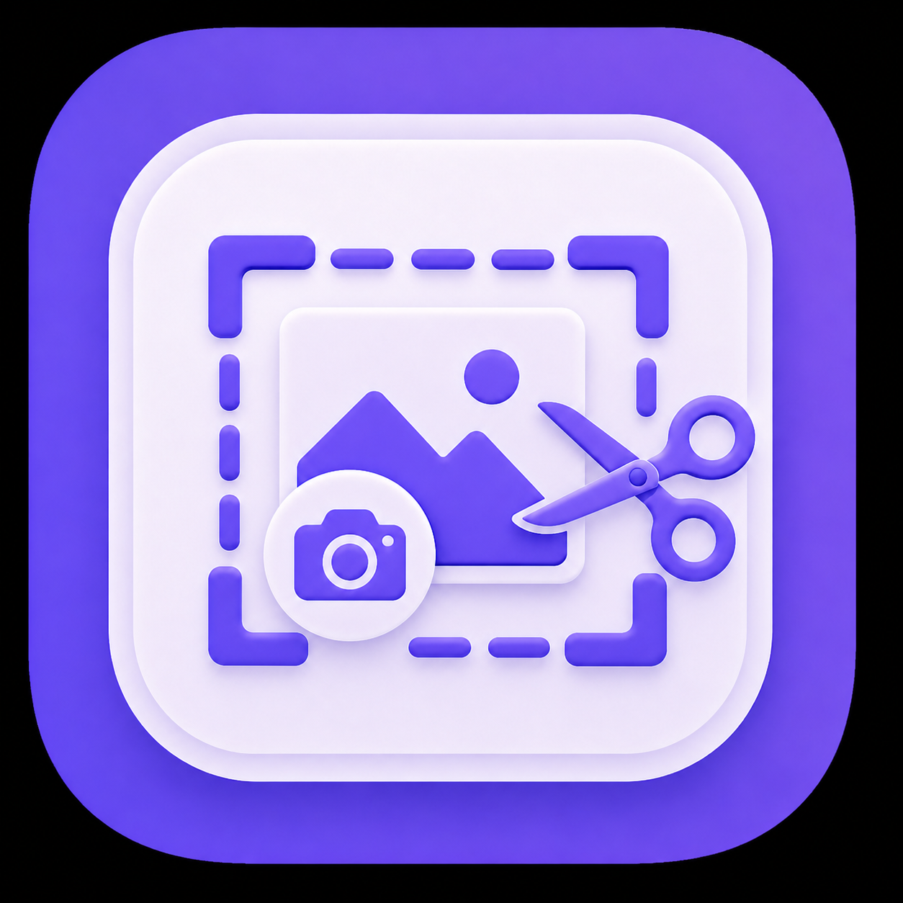

<p align="center">
  
</p>

# 📸 Capturo

Capturo is a fast, local screenshot and GIF tool for Windows. It lives in the notification area, opens straight into region selection, and gets out of the way when you finish. There is no dashboard, account, cloud storage, telemetry, or history database.


> 🪟 **Windows 11 is the only tested and supported platform.** macOS code paths exist, but they have never been verified on Apple hardware and no macOS package is published.


## ⬇️ Download

The latest stable release is **Capturo 0.18.0** for Windows x64. Download the installer from [GitHub Releases](https://github.com/mtom2k/capturo/releases/latest).

| Local artifact | Purpose |
| --- | --- |
| `Capturo-Setup-0.18.0-x64.exe` | Interactive Windows installer |
| `Capturo-Portable-0.18.0-x64.exe` | Portable build for local validation |

Official GitHub releases publish the installer. Both local artifacts are kept in `release/`, and `BUILD-INFO.txt` records their sizes and SHA-256 hashes.

Windows may show an unknown-publisher warning because current builds are not Authenticode-signed. Choose **More info**, then **Run anyway** if you trust the downloaded checksum.

The repository also contains the new camera/scissors logo shown above. The published v0.18.0 installer predates this cosmetic refresh, so the new artwork will appear in packaged installations after the next build and release.

## ✨ What Capturo can do

- Select, move, and resize a precise screen region on scaled or multi-display Windows desktops.
- Draw with Pen, Line, Arrow, Rectangle, Ellipse, numbered Step, and Text tools.
- Add Blur and Pixelate regions with independent 1 to 100 percent intensity.
- Remove a connected background color with tolerance, feathering, live Before/After/Split preview, and Undo.
- Extract visible text with local Windows OCR and copy it as plain text.
- Record a GIF with a configurable pre-timer, frame rate, quality, pause/resume, and protected recording controls.
- Review GIFs before export, then Copy, Save, Open folder, Retake, or Discard.
- Capture HDR displays through a native Windows helper without washed-out SDR content.
- Save PNG or JPEG files, copy a lossless image, and rebind screenshot and GIF shortcuts.
- Start with Windows and check GitHub Releases for updates when you choose.

## 🖼️ Screenshot workflow

1. Click the Capturo tray icon or press `Ctrl + Shift + 2`.
2. Drag a region. Move it from inside, or resize it from an edge or corner.
3. Annotate or apply privacy and transparency tools.
4. Copy the image, copy its visible text, or save it.


The primary toolbar stays close to the selection. A second row appears only when the active tool needs options such as color, stroke width, text style, or effect intensity.

### Copy text with Windows OCR

**Copy text** sits beside regular Copy. It recognizes the final visible selection, including its crop, annotations, Blur or Pixelate regions, and any pending transparency preview. Successful recognition copies plain text and closes the editor. Empty or failed recognition leaves the editor open with a useful message.

OCR runs locally through Windows and uses language packs installed for the current user. Capturo does not upload the image, download a model, or create a temporary screenshot. OCR can still confuse small, stylized, rotated, low-contrast, or obscured characters, so review important results.

### Transparent backgrounds

Choose **Transparent background** or press `K`, then sample the background inside the selection. Capturo removes only matching pixels connected to that point, which protects separated foreground areas that happen to share the same color.

Tolerance includes nearby tones, and Edge feather smooths the cutout from 0 to 10 pixels. You can also enter hex or RGB values and compare Before, After, or Split views. Copy and Save automatically apply a pending preview. Any transparency operation forces PNG because JPEG cannot store alpha.

## 🎬 GIF recording

Choose **New GIF** from the tray or press `Ctrl + Shift + 3`. Select a region, then press **Start Recording**. Capturo prepares the live stream and shows a protected countdown, 3 seconds by default, before active capture begins.

The recording bar supports Pause, Resume, Stop, a timer, and optional frame totals. Its red border, dimmed surroundings, and controls are excluded from the finished GIF. Playback timing follows real elapsed recording time, and encoder backpressure keeps memory bounded when a large region cannot sustain the requested frame rate.


The preview lets you Copy, Save, Open folder, Retake, or Discard. Windows Copy places the animated `.gif` file on the clipboard instead of flattening it to a still image. An unsaved GIF is written to Capturo's temporary clipboard folder only after you explicitly choose Copy, and expired copies are cleaned during a later launch.

## ⌨️ Shortcuts

| Shortcut | Action |
| --- | --- |
| `Ctrl + Shift + 2` | Start screenshot capture |
| `Ctrl + Shift + 3` | Start GIF capture |
| `Ctrl + C` | Copy image |
| `Ctrl + Shift + C` | Extract and copy visible text |
| `Ctrl + S` | Save |
| `Ctrl + Z` | Undo |
| `Delete` | Delete selected annotation |
| `Esc` | Cancel capture or close GIF preview |

Tool keys: `V` Select, `P` Pen, `L` Line, `A` Arrow, `R` Rectangle, `E` Ellipse, `N` Step, `T` Text, `B` Blur, `X` Pixelate, and `K` Transparent background.

## ⚙️ Settings

Right-click the tray icon and choose **Settings**.

- **Global:** Open on startup, optional daily update checks, and manual Check for updates.
- **Capture:** PNG or JPEG, JPEG quality, copy/save notifications, and capture shortcut.
- **GIF:** 10 to 30 fps, quality, 0 to 10 second pre-timer, frame-count visibility, and GIF shortcut.

Preferences live in `settings.json` under Capturo's user-data folder. The file contains options and the last update-check time, never captured pixels.


## 🔒 Privacy

- No account, login, telemetry, analytics, or crash reporting.
- Captures and OCR pixels stay local.
- The only optional network request checks Capturo's public GitHub Release version. It sends no account token, device identifier, capture, or settings data, and never downloads an update.
- Screenshot pixels reach disk only when you Save. The one exception is an unsaved GIF that you explicitly Copy, because the Windows clipboard carries its file path.
- Renderers use sandboxing, context isolation, and no Node.js access. Native actions pass through narrow IPC handlers owned by the main process.

## ⚠️ Current limits

- A selection stays on one physical display and cannot span monitors.
- A drag must start in the work area, although it can continue over the taskbar.
- OCR quality depends on the source image and installed Windows language packs.
- Windows packages are unsigned and may trigger SmartScreen.
- macOS remains untested, unsigned, un-notarized, and unsupported.

## 🛠️ Build from source

Capturo needs Node.js 20 or newer.

```powershell
git clone https://github.com/mtom2k/capturo.git
cd capturo
npm install
npm run dev
```

Useful commands:

```powershell
npm run icons      # regenerate every logo size from build/icon-source.png
npm run build      # typecheck, run tests, and build the production app
npm run dist:win   # build Windows Setup and Portable artifacts into release/
```

HDR capture, local OCR, GIF file copy, and recording-window styling use `native/capturo-capture`. Build it with the Visual Studio **Desktop development with C++** workload and Windows SDK:

```powershell
native\capturo-capture\build.cmd
```

## 📚 Developer documentation

- [ARCHITECTURE.md](./ARCHITECTURE.md) explains process boundaries and data flow.
- [DECISIONS.md](./DECISIONS.md) records durable design choices.
- [PROJECT_STATE.md](./PROJECT_STATE.md) tracks verified behavior and remaining work.
- [HANDOFF.md](./HANDOFF.md) is the shortest path for the next developer or LLM.
- [TESTING.md](./TESTING.md) contains automated and desktop test matrices.
- [CONTRIBUTING.md](./CONTRIBUTING.md), [RELEASING.md](./RELEASING.md), and [CHANGELOG.md](./CHANGELOG.md) cover maintenance and releases.

## 📄 License

MIT. See [LICENSE](./LICENSE).
